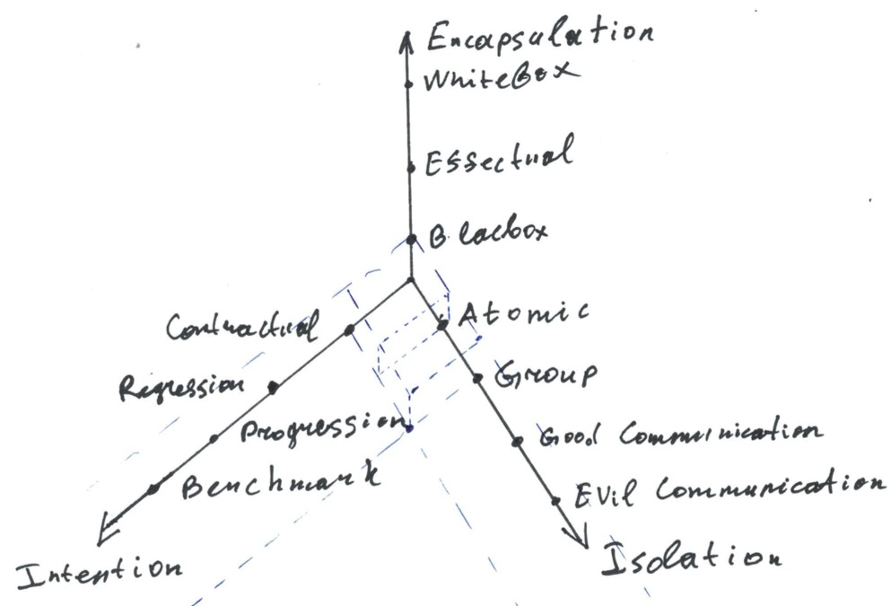

# Unit, Functional, Integration? You are doing it wrong

## Summary

Many engineers don't pay enough attention to tests. There are two reasons for this:
it's hard to make good tests and it's not easy to formalize which tests are good and which are bad.

We have created own test taxonomy, an alternative to classic Unit/Functional/Integration trinity,
allowing engineers to establish useful guidelines for their work on test suites.

We also created a Dependency Injection mechanism for Scala making it a lot easier to write good test suites.

## The problem

We all write tests. Most of us do it regularly. Many of us consider tests as important as our business logic is because tests establish important contracts and greatly reduce maintenance costs.

Not all the tests are equal though. Once we wrote them we start noticing that some of them are helpful and some of them
just are troublesome.

We may say that bad tests are:

1. Slow
2. Unstable: they fail randomly
3. Nonviable: don't survive refactorings
4. Demanding: require complex preconditions to be met: external services up and running, fixtures loaded, etc, etc
5. Incomprehensible: they signal about a problem but don't help us to localize the cause

Though the question is: how do we write better tests? How do we choose the best possible strategy when we start writing a test?

It's surprisingly hard to answer that question and I think that one of the reasons for that is the fact that we... just miss proper vocabulary and improperly use the existing one.

We used to classify tests using words like "Unit", "Functional" and "Integration" (also "System", "Performance", "Acceptance"). And we think something like "unit tests are better than functional tests and integration tests are the worse". We also know that it's good to have high coverage.

Usual definitions are:

1. A unit test checks the functionality of individual modules or units,
2. A functional test checks whether the system works according to the requirements,
3. An integration test checks related programs, modules or units of code,

Let's assume we have a system with the following components:

1. `ILoanCalculator` with one implementation --- `LoanCalculatorImpl`
2. `IUserRepository` with two implementations --- `UserRepositoryPosgresImpl` and `UserRepositoryInMemoryImpl`
3. `IAccountingService` with one implementation --- `AccountingServiceImpl`. It depends on `IUserRepository` and `ILoanCalculator`.
4. An HTTP server exposing RPC API.

We wrote a test for `IAccountingService` then wired our test with `LoanCalculatorImpl` and `UserRepositoryPosgresImpl`.

Is it an integration test? It seems like it is. It involves several components of our program and talks with the database.
Is it a functional test? Maybe - it's checking if an important service of our system conforms to a specification.
Is it a unit test? Maybe - it checks the functionality of a system module.

Things get more interesting in case we make our test abstract and add another implementation using `UserRepositoryInMemoryImpl`. So, should we continue to call it an integration test? It seems so. The test doesn't talk with the database anymore but still involves several components. Is it still a functional test? Yes. Is it still a unit test? Yes.

But intuitively this new implementation is in many aspects better than the other one: most likely it's faster, it does not require any preconditions (running database) to be met and there are fewer potential exceptions.

So, something important changed, but we may not know how to call that change. And our test taxonomy was useless.

Let's build a better one.

## The Constructive Test Taxonomy

Let's assume that

1. We may assign an arbitrary amount of *tags* to a test,
2. We have several predefined tag sets
3. We may assign no more than one tag from each of the sets to a test --- in case we want more than one the test may be split,
4. We may establish a full or partial order on each of the sets and assign weights to the elements.

Let's call these sets "Axis" and try to come up with some useful axis.

### Intention Axis

Each test is written with some intentions behind it.

Most common intentions are:

1. To test some "specifications", "contracts" or "behaviours" of our code. Let's call such tests *contractual*,
2. When we discover an issue in our code we usually write a test confirming it, fix it and keep the test as a *regression* test,
3. When we know a problem but cannot fix it due to design issue broken external library or whatever else we may write a *progression* test confirming incorrect behaviour (just in case this test type is very underestimated),
4. When we need to check the performance of our code we write *benchmarks*.

So, our first axis is called "Intention" and has possible values `{ Contractual | Regression | Progression | Benchmark }`.

For a default guideline, we may say that Contractual tests are more important than Regression, Regression tests are more important than Progression ones and in most  cases Benchmarks have the lowest importance. So the may introduce the weights for the axis points:

`Intention = { 1: Contractual | 2: Regression | 3: Progression | 4: Benchmark }`

### Encapsulation Axis

A test may test just interfaces not knowing anything about implementations behind them. We may call them *Blackbox* tests.

*Whitebox* tests may know about implementations and check them directly (sometimes even breaking into some internal state to verify if it conforms to test expectations).

Blackbox tests do not break encapsulation and can survive many refactorings because of that. It's a very important property, so we should always try to write Blackbox tests and avoid Whitebox ones at all costs.

Other tests may check just interfaces but also verify some side-effects (a file created on the disk) which cannot be (or are hard to) explicitly expressed. Let's  call them *effectual* tests. We may write them but it's always better to avoid it when possible.

Now we may define our "Encapsulation" axis:

`Encapsulation = { 1: Blackbox | 10: Effectual | 100: Whitebox }`

Whitebox tests are very expensive, so I've assigned them a high weight.

### Isolation Axis

Some tests check just one software component. It may be a single function or a single class. These tests have the best issue localization possible. We may call them *atomic* tests because they check one unsplittable entity.

Some tests may involve multiple software components but do not interact with anything outside of the program. So they test "aggregates" or "groups" of our entities, and we may call them *group* tests.

Some tests may communicate with the outer world (databases, API providers, etc, etc). So we may call them *Communication* tests. Such tests are usually less repeatable and slow and should be avoided when possible.

Now we may define our "Isolation" axis:

`Isolation = { 1: Atomic | 5: Group | 100: Communication Good | 1000: Communication Evil }`

#### Different kinds of Communication

We may notice that there are at least two important Communication test subtypes. What's the difference between a test calling a Facebook API and a PostgreSQL database?
We can control and restart the database, but we can't do anything with Facebook. And the tests which interact with something outside of the developer's area of control are the most expensive ones and just the source of pure evil. We call them *Evil Communication* tests.

The tests which do not interact with something beyond our control may be called *Good Communication* tests.

### Test Space

Now we have several axes, so we may build a multidimensional "space" consisting of at least `3*3*4=36` test classes. Also, we may use "distance" to the zero point as a simple scalar metric allowing us to roughly estimate which tests are "better".

Two blue boxes near the "zero" correspond to two test classes having the highest value for us --- "Contractual-Blackbox-Atomic" and "Contractual-Blackbox-Group".

Also, you may try to use the following pseudo-formula to roughly estimate your maintenance costs associated with a test:

`MaitenanceTime ~ (Encapsulation_Weight * Atomicity_Weight * Intention_Weight ) / √(coverage)`

### Your very own axis

Taxonomies are hard and it's not so easy to build a perfect one.
The one we propose is not perfect as well. You may give it a try, it's useful, but in case you are unhappy with something, nothing can prevent you from adding your axes or altering ones presented in this post.
Every team and project has its own needs and workflows so it may be a good idea to tailor a proper vocabulary for your specific needs. A proper test taxonomy may make a very useful guideline, help establish good practices and reduce maintenance costs. Just try to be precise and don't forget to make guides and notes.

### Observations and conclusions

1. All the axis miss the zero-weighted element. What would correspond to it? Contracts expressed in your design and types. When your system does not allow incorrect state there is nothing to test and maintenance cost may be nearly zero (or maybe not, it may be hard to extend a system with rigid contracts specified in types),
2. You may document your tests adding abbreviations corresponding to the test type. For example "CBG" may stand for a "Contractual-Blackbox-Group" test.

## Modules, Dependency Injection, and better tests

### Dual Tests Tactic

There is a simple but powerful tactic which helps us a lot:

1. We design our code and tests the way we test most of code through interfaces,
2. We create a "dummy" or "mock" implementation for every single entity which communicates with the outer world,
3. For each abstract test we create at least two implementations: one wired with production implementations, another one --- with dummy ones,
4. We skip "production" tests when they cannot be run (a service is not available, etc).

Previously we've been doing it manually and even it that case it worths it.

Now we automated it.

### An upcoming talk

A good module system and/or dependency injection framework may be very useful if you wish to make your tests fast and reliable. We are going to make a talk at [Functional Scala](https://www.functionalscala.com/) regarding our bleeding-edge approaches to testing and how [distage](https://izumi.7mind.io/latest/release/doc/distage/index.html), our dependency injection framework and module system with an automatic solver for Scala may help you to cut your development costs.

## P.S.

I would be happy to know your thoughts and ideas on the subject. You may contact me on [twitter](https://twitter.com/shirshovp).
