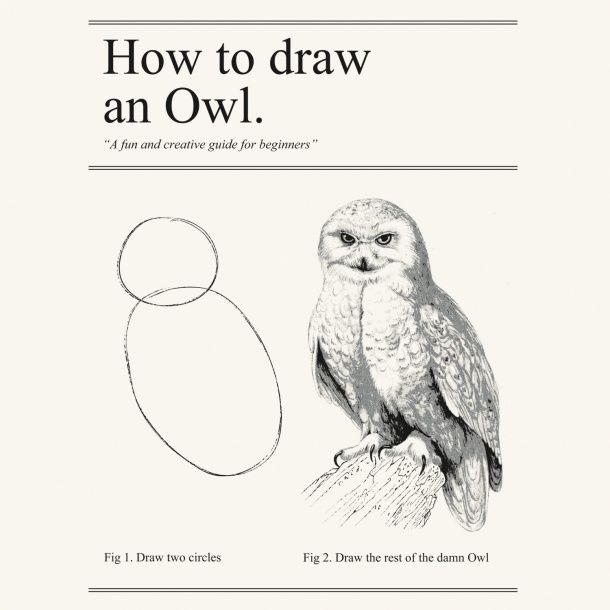

Lightweight Scala Reflection and why Dotty needs TypeTags reimplemented
=======================================================================

## Summary

`TypeTag` in `scala-reflect` is great but flawed. In this article I provide some observations of my experience of building
a custom type tag, not depending on `scala-reflect` in runtime, potentially portable to dotty and providing equality and subtype checks. My model is not completely correct though it is enough for most of the purposes. Also I hope that this post may help convince Dotty team to support some form of type tags.


## Introduction

[Type tags](https://docs.scala-lang.org/overviews/reflection/typetags-manifests.html) are one of the most attractive features of Scala.

They allow you to overcome type erasure, check subtyping and equality. Here is an example:

```scala
import scala.reflect.runtime.universe._

def check[T : TypeTag](v: T) = {
  val tag = implicitly[TypeTag[T]].tpe
  println(s"//↳value $v is of type $tag")

  if (tag =:= typeTag[Right[Int, Int]].tpe) {
    println(s"//↳value $v has exact type of Right[Int, Int]")
  }

  if (tag <:< typeTag[Either[Int, Object]].tpe) {
    println(s"//↳value $v is a subtype of Either[Int, Object]: $tag")
  }
}

check(Right[Int, Int](1))
//↳value Right(1) is of type scala.util.Right[Int,Int]
//↳value Right(1) has exact type of Right[Int, Int]

check(Right[Nothing, Int](1))
//↳value Right(1) is of type scala.util.Right[Nothing,Int]

check(Right("xxx"))
//↳value Right(xxx) is of type scala.util.Right[Nothing,String]
//↳value Right(xxx) is a subtype of Either[Int, Object]: scala.util.Right[Nothing,String]
```

`TypeTag` lets you do a lot more. Essentially, `scala-reflect` and `TypeTag` machinery are chunks of internal compiler data structures and tools exposed directly to the user. Though the most important operations are equality check (`=:=`) and subtype check (`<:<`) --- in case you have them you may implement whatever else you need at least semi-automatically.

Concept of a type tag is a cornerstone for our project --- [distage](https://izumi.7mind.io/latest/release/doc/distage/index.html) --- smart module system for Scala, featuring a solver and a dependency injection mechanism.

Type tags allows us to turn an arbitrary function into an entity we can introspect at both compile time and run time ([Scastie](https://scastie.scala-lang.org/Xn6CdjfkRAS8Sx9xhRmn0A)):

```scala
import com.github.pshirshov.izumi.distage.model.providers.ProviderMagnet

val fn = ProviderMagnet {
    (x: Int, y: String) => (x, y)
  }.get

println(s"//↳function arity: ${fn.arity}")
//↳function arity: 2
println(s"//↳function signature: ${fn.argTypes}")
//↳function signature: List(Int, String)
println(s"//↳function return type: ${fn.ret}")
//↳function return type: (Int, String)
println(s"//↳function application: ${fn.fun.apply(Seq(1, "hi"))}")
//↳function application: (1,hi)
```

Unfortunately, current TypeTag implementation is flawed:

- They [do not support](https://github.com/scala/bug/issues/7686) higher-kinded types, you cannot get a `TypeTag` for `List[_]`,
- They suffer many [concurrency issues](https://github.com/scala/bug/issues/10766) --- in our case TypeTags were occasionaly failing subtype checks (`child <:< parent`) during `scala-reflect` initialization even if we synchronize on literally everything --- and it's not so trivial to fix them,
- `scala-reflect` needs *seconds* to initialize.

Moreover, it's still unclear if Scala 3 will support `TypeTag`s or not.
Some people say it's too hard and recommend to write a custom macro to replace TypeTags for in Scala 3 / Dotty when it's necessary.

So, we tried to implement our own lightweight TypeTag replacement with a macro. It's doable. It works. Though it's overcomplicated and there are many subtle discrepancies between Scala model and our model. So we still hope that Dotty team will consider supporting TypeTags in Scala 3. Currently our implementation supports Scala 2.12/2.13 though it's possible to port it to Dotty and we are going to do it in foreseeable future.

## What we need

The following features are essential for `distage` and very useful for many different purposes:

- An ability to combine type tags at runtime:
  ```scala
  CustomTag[List[_]].combine(CustomTag[Int])
  ```
- An ability to check if two types are identical:
  ```scala
  assert(CustomTag[List[Int]] =:= CustomTag[List].combine(CustomTag[Int]))
  ```
- An ability to check if one type is a subtype of another:
  ```scala
  assert(CustomTag[List[Int]] <:< CustomTag[List[Any]])
  assert(CustomTag[Either[Nothing, ?]] <:< CustomTag[Either[Unit, ?]])
  ```


## Starting point: undefined behavior in Scalac helps to circumvent TypeTag limitations

Unfortunately, there is no way in Scala to request a TypeTag for an unapplied type (or a "type lambda").
The model itself can express it but there is no syntax for that.

So, this doesn't work:

```scala
type T[K] = Either[K, Unit]
typeTag[T] // fail
```

Fortunately there are two workarounds for that.


### Undefined behavior for rescue: simple materializer

For some reason `scalac` ignores type parameters passed to a type within macro definition:

```scala
import scala.language.experimental.macros
import scala.reflect.macros.blackbox
import scala.reflect.runtime.universe._

trait LightTypeTag { /*TODO*/ }

def makeTag[T: c.WeakTypeTag](c: blackbox.Context): c.Expr[LightTypeTag] = {
  import c.universe._
  val tpe = implicitly[WeakTypeTag[T]].tpe
  // etaExpand converts any type taking arguments into PolyTypeApi ---
  // a type lambda representation
  println(("type tag", tpe.etaExpand))
  println(("unbound type parameters", tpe.typeParams))
  println(("result type", tpe.etaExpand.resultType.dealias))
  c.Expr[LightTypeTag](q"null")
}

def materialize1[T[_]]: LightTypeTag = macro makeTag[T[Nothing]]

type T0[K, V] = Either[K, V]
type T1[K1] = T0[K1, Unit]

materialize1[T1]
```

This example prints

```
(type tag,[K1]T1[K1])
(unbound type parameters,List(type K1))
(result type,scala.util.Either[K1,Unit])
```

Now we may see that:

- `Nothing` has disappeared out of `T[Nothing]`,
- We've successfully circumvented Scala's syntactic limitations and got a weak type tag for our unapplied `type T1[K]`! It's an undefined but logical and very useful behaviour,
- Scala can expand all the nested lambdas into a single lambda.

### Better approach

Previous trick would require us to manually write a custom materializer for every kind we want to get our type tags for. So there is another approach which is more useful for practical usage.

We wrap our type lambda into a structural refinement of a type:

```scala
trait HKTag[T] {
  // ...
}

type Wrapped = HKTag[{ type Arg[A] = K[A] }]
```

Now we got rid of these damn type arguments and may analyse different `Wrapped` types uniformly.
This is outside of the scope of this post, you may find completed and working example in [distage repository](https://github.com/7mind/izumi/tree/403bbf669fd2ab6924564f821cb52c459c3be082/fundamentals/fundamentals-reflection/src/main/scala/com/github/pshirshov/izumi/fundamentals/reflection)

## Designing data model

We want to use a macro to statically generate non-ambigious type identifiers. And we have the following Scala features to support:

- [Parameterized types](https://docs.scala-lang.org/tour/generic-classes.html) (Generics),
- [Unapplied types](http://eed3si9n.com/herding-cats/Kinds.html) (type lambdas, higher-kinded types),
- [Compound types](https://docs.scala-lang.org/tour/compound-types.html):  `val v: Type1 with Type2`,
- [Structural types](https://docs.scala-lang.org/style/types.html#structural-types): `val v: {def repr(a: Int): String}`,
- [Path-dependent types](https://docs.scala-lang.org/tour/inner-classes.html): `val a: b.T`. Actually it's very hard to provide comprehensive support for PDTs but we may do it to some extent,
- [Variances](https://docs.scala-lang.org/tour/variances.html): `trait T[+A]`,
- [Type bounds](https://docs.scala-lang.org/tour/upper-type-bounds.html): `trait T1[K <: T0]`


Essentially, we have two primary forms of our types, applied and unapplied. So, let's encode this:

```scala
sealed trait LightTypeTag
sealed trait AppliedReference extends LightTypeTag
sealed trait AppliedNamedReference extends LightTypeTag
```

Now we may define helper structures, describing type bounds and variance:

```scala
sealed trait Boundaries
object Boundaries {
  case class Defined(bottom: LightTypeTag, top: LightTypeTag) extends Boundaries
  case object Empty extends Boundaries
}

sealed trait Variance
object Variance {
  case object Invariant extends Variance
  case object Contravariant extends Variance
  case object Covariant extends Variance
}
```

`Boundaries.Empty` is just an optimization for default boundaries of `>: Nothing <: Any` intended to make generated tree more compact.

**Gotcha**: type bounds in Scala are recursive! So it's pretty hard to restore them properly, but we may detect recursive and loose the boundaries appropriately.

So, we will identify nongeneric types using their fully qualified names. A type may have a prefix (in case it's a PDT) and type boundaries (in case it's an abstract type parameter):

```scala
case class NameReference(
    ref: String,
    boundaries: Boundaries,
    prefix: Option[AppliedReference]
  )extends AppliedNamedReference
```

Now we may define reference for a generic. It's a recursive structure with an fully qualified type name and a list of arbitrary type tags representing generic arguments:

```scala
case class TypeParam(ref: LightTypeTag, variance: Variance)
case class FullReference(
    ref: String,
    parameters: List[TypeParam],
    prefix: Option[AppliedReference]
  ) extends AppliedNamedReference
```

And now we may define a type lambda:

```scala
case class Lambda(
    input: List[LambdaParameter],
    output: LightTypeTag
  ) extends LightTypeTag
case class LambdaParameter(name: String)
```

The compound type is simple:

```scala
case class IntersectionReference(refs: Set[AppliedNamedReference]) extends AppliedReference
```

And here comes structural type:

```scala
sealed trait RefinementDecl
object RefinementDecl {
  case class Signature(
    name: String,
    input: List[AppliedReference],
    output: AppliedReference
  ) extends RefinementDecl

  case class TypeMember(
    name: String,
    ref: LightTypeTag
  ) extends RefinementDecl
}

case class Refinement(
    reference: AppliedReference,
    decls: Set[RefinementDecl]
  ) extends AppliedReference
```

There are many ways this model can be improved. For example it's better to use a `NonEmptyList` in `FullReference` and `Lambda`, some prefixes, allowed by the model, are invalid,  etc, etc. Though it may do the job. Also it provides equality check for free in case we follow some simple rules while building our tags. I would be happy to get any improvement proposals.

## The logic behind

In this section we will consider primary caveats I faced and and design choices I made while working on my implementation.

### Compile time: type lambdas and kind projector

Type lambdas are represented as `PolyTypeApi`. They always have empty `typeArgs` list and at least one element in `typeParams` list. We may access lambda result type using `.resultType.dealias` methods.

Unfortunately, the following things require different approach

-  type lambdas encoded with type projections,
- code produced by [Kind Projector](https://github.com/typelevel/kind-projector) ---  a plugin, providing us a way to encode type lambdas in scala with sane syntax.

In both of the cases `takesTypeArgs` returns `true` but the types are not instances of `PolyTypeApi`. So we have to make sure that we call `etaExpand` before we process our lambda --- to make sure that we are processing an actual lambda.

Next thing is: result type of a type lambda is always an applied type. Lambda parameters are visible as concrete types there:  in case we have `type L[A] = List[A]` result type of such a lambda will be `List[A]` where `A` is a "concrete" type.

So, when we process a type lambda we need to figure out argument names first, then recurse into result type substituting type parameters with corresponding lamda parameters.

An example:

```scala
def toPrefix(tpef: u.Type): Option[AppliedReference] = ???
def makeBoundaries(t: Type): Boundaries = ???
def toVariance(tpes: TypeSymbol): Variance = ???

def makeRef(tpe: Type, context: Map[String, LambdaParameter]): AbstractReference = {
  def makeLambda(t: Type): AbstractReference = {
    val asPoly = t.etaExpand
    val result = asPoly.resultType.dealias
    val lamParams = t.typeParams.zipWithIndex.map {
      case (p, idx) =>
        p.fullName -> LambdaParameter(idx.toString)
    }
    val reference = makeRef(result, lamParams.toMap)
    Lambda(lamParams.map(_._2), reference)
  }

  def unpack(t: Type, context: Map[String, LambdaParameter]): AppliedNamedReference = {
    val tpef = t.dealias.resultType
    val prefix = toPrefix(tpef)
    val typeSymbol = tpef.typeSymbol
    val b = makeBoundaries(tpef)
    val nameref = context.get(typeSymbol.fullName) match {
      case Some(value) =>
        NameReference(value.name, b, prefix)
      case None =>
        NameReference(typeSymbol.fullName, b, prefix)
    }

    tpef.typeArgs match {
      case Nil =>
        nameref
      case args =>
        val params = args.zip(t.dealias.typeConstructor.typeParams).map {
          case (a, pa) =>
            TypeParam(makeRef(a, context), toVariance(pa.asType))
        }
        FullReference(nameref.ref, params, prefix)
    }
  }

  val out = tpe match {
    case _: PolyTypeApi =>
      makeLambda(tpe)
    case p if p.takesTypeArgs =>
      if (context.contains(p.typeSymbol.fullName)) {
        unpack(p, context)
      } else {
        makeLambda(p)
      }
    case c =>
      unpack(c, context)
  }

  out
}
```


Also we need an API allowing us to apply and partially apply a lambda. This will be the cornerstoune of our type tag combinators:

```scala
def applyLambda(lambda: Lambda, parameters: Map[String, AbstractReference]): AbstractReference
```

This method should recursively replace all the references to lambda arguments with corresponding type references from `parameters` map. So ```apply(λ %0, %1 → Map[%0, %1], Int)``` becomes ```λ %0 → Map[Int, %0]```. This job is mostly mechanical.


### Compile time: refinement types

For some reason not all the refined types implement `RefinedTypeApi`, so we have to use internal `scalac` structures to make sure
we don't miss anything. Here is a working extractor:

```scala
import c._
final val it = universe.asInstanceOf[scala.reflect.internal.Types]

object RefinedType {
  def unapply(tpef: Type): Option[(List[Type], List[SymbolApi])] = {
    tpef.asInstanceOf[AnyRef] match {
      case x: it.RefinementTypeRef =>
        Some((
          x.parents.map(_.asInstanceOf[Type]),
          x.decls.map(_.asInstanceOf[SymbolApi]).toList
        ))
      case r: RefinedTypeApi =>
        Some((r.parents, r.decls.toList))
      case _ =>
        None
    }
  }
}

val t: Type = ???
t match {
  case RefinedType(parents, decls) =>
    //...
}
```

### Runtime: subtype checks

Equality check is trivial --- we just need to use `equals` on our model instances.
Subtype check is very complicated. I wouldn't discuss it here, you may refer to my [actual implementation](https://github.com/7mind/izumi/blob/develop/fundamentals/fundamentals-reflection/src/main/scala/com/github/pshirshov/izumi/fundamentals/reflection/macrortti/LightTypeTagInheritance.scala).

 It's hard to understand what we even need to perform the check.

Right now I'm storing the following data:

```scala
val baseTypes: Map[AbstractReference, Set[AbstractReference]]
val baseNames: Map[NameReference, Set[NameReference]]
```

I use `baseNames` to compare `NameReference`s and `baseTypes` for all other things.

There is one caveat: `scalac` does not provide consistent representation for base types of unapplied types. So it's not so easy to figure out that `Seq[?]` is a base type for `List[?]`.

Fortunately the type names in the base type reference correspond to the names type parameters list:

```scala
import scala.language.experimental.macros
import scala.reflect.macros.blackbox
import scala.reflect.runtime.universe._

val tpe = typeTag[List[Int]].tpe.typeConstructor
// tpe is a type of a type lambda

val baseTypes = tpe.typeConstructor.baseClasses.map(t => tpe.baseType(t))
// all the elements of baseTypes are applied. `A` is a "concrete" type
// List(List[A], scala.collection.LinearSeqOps[A,[X]List[X],List[A]], Seq[A], ...)

// though type names will correspond to type arguments
val targs = tpe.etaExpand.typeParams
// fortunately type names are the same
// List[reflect.runtime.universe.Symbol] = List(type A)
```

So, we may reconstruct each base type using type parameters to populate the `context` for `makeRef`.

## The rest of the damn Owl

I provided some basic insights into the problem. In case you wish to look at the full implementation, you may find it [in our repository](https://github.com/7mind/izumi/tree/develop/fundamentals/fundamentals-reflection/src/main/scala/com/github/pshirshov/izumi/fundamentals/reflection/macrortti). It has 2K+ LoC and has all the necessary features implemented. Also there are some logging facilities allowing you to get a detailed log of what happens during subtype checks.

We would welcome any contributions into our library and feel free to use this post and our code as a starting point for your own implementation.



## Conclusion

It's possible to implement `scala-reflect`-like features with a macro. Though it's a challenging task.
At the same time for many enterprise developers good reflection is one of the most attractive Scala features.
It allows us to have many positive traits of dynamic languages without giving up on type safety.

I wrote this post with a hope that it may help to convince Dotty team to re-implement reflection in Scala 3.
In case it wouldn't, we, [Septimal Mind](https://7mind.io) will try to maintain our solution and port it to Dotty,
but, as I mentioned earlier, it's not possible to make it completely correct.
